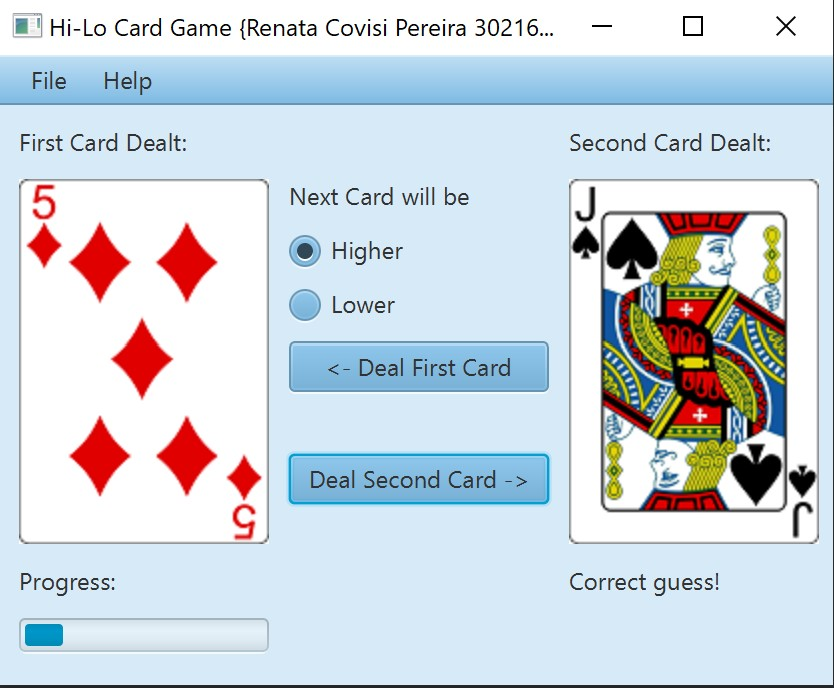

# HiLo Card Game

Assignment of the subject HCI and GUI Programming.

HiLo is a card game where a card is dealt and the player has to guess whether the next
card that is dealt will be higher or lower than the first card. 

